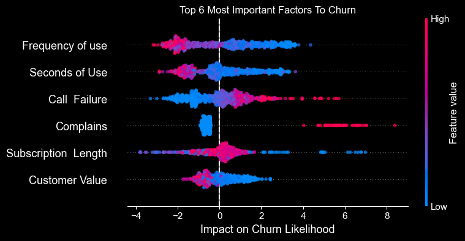
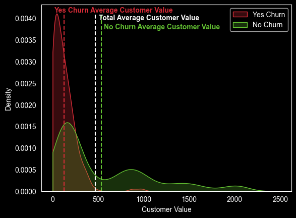

# Predicting Customer Churn for Iranian Telecom
*This readme is only a high-level overview. Please refer to the jupyter notebook "main.ipynb" in the root directory for a detailed analysis.*

This project uses historical customer data to construct and evaluate a machine-learning model to predict customer churn for an Iranian telecom company. The model I developed captures 90% of those who will churn. Of those customers predicted to churn by the model, 80% did churn. Interpretability metrics from the model also suggest experiments to reduce churn and enhance understanding of customer behavior.

## Data

The dataset, hosted by UC Irvine, contains clean data for 3150 customers of an Iranian Telecom company over 9 months. Features include call failures, usage frequency, customer value, and complaints, among others. The target variable is churn measured at the 12-month mark.

## Model and Performance

The best-performing model was determined after tuning via grid search. The chosen model is a high-performance and highly scalable gradient-boosted decision tree inspired by XGboost with parameters detailed in the main notebook.

## Who Churns?

Using the trained model we can construct a SHAP summary plot to show the most important factors to churn. The plot is shown below. SHAP values are a measure of how much a specific feature contributes to the prediction of churn. It's very important to note that SHAP values do not truly capture the causality of a system. Take the plot as a hint for areas where we could do more focused experimentation to improve our understanding of our customers.

There are two major routes a customer can take to churn. They can either churn because the service failed them in some way (call failure and complains) or because the customer doesn't use the service much (frequency of use, seconds of use, sub-length, and customer value). 

Let's examine customer value closer. The SHAP values plot indicates that most of the churn happens with low-value customers but let's make sure we're not missing anything. Below is the distribution of customer value for churn and not churn customers.

The plots are individually normalized so don't compare the heights between yes and no churn, only with how they are spread out over customer value. The majority of customers who churn are low value, confirming what's seen in the SHAP summary plot. There are a very small number of customers who are of higher value who churned through the complaint/call failure route. 

## Conclusion and Suggested Next Steps
The model catches 90% of those customers who will churn and 80% of those who are predicted to churn will churn. It is biased towards false positives rather than false negatives, which is acceptable for this task. We care much more about catching someone who might churn than trying to keep a customer who might have stayed with us anyway.

 We could continue to tune our model or introduce new models to form a stacked ensemble to improve our predictions, but the more fruitful next steps could be setting up A/B experiments to address the two routes of churn.

- Experiment with improving or changing how we deal with failures of our service (when we get a complaint or detect call failures). Through more careful survey work of customers who complain after a call failure versus those who do not.

- Experiment with how we can get those who don't use the service much to use it more, possibly through small gamification elements, free credit, or other habit-forming hooks.

Thanks for reading! Make sure to check out the more detailed write-up in main.ipynb if you want more detail on everything discussed here.
