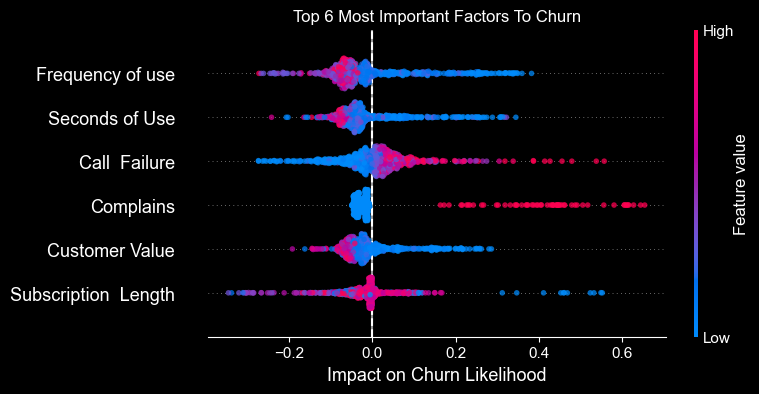

# Predicting Customer Churn for Iranian Telecom
*This readme is only a high level overview. For a detailed analysis, please refer to the jupyter notebook "main.ipynb" in the root directory.*

This project focuses on constructing and evaluating a machine learning model to predict customer churn for an Iranian telecom company using historical customer data. A model was made that catches 90% of those who will churn, and 80% of those who are predicted to churn did churn. The model is also used to give suggestions for further experimentation into reducing churn and improving our understanding of our customers.

## Data

The dataset, hosted by UC Irvine, contains clean data for 3150 customers of an Iranian Telecom company over a 9-month period. Features include call failures, usage frequency, customer value, and complaints, among others. The target variable is churn measured at the 12-month mark.

## Model and Performance

The best-performing model was determined after tuning via grid search. The chosen model is a high performance and highly scalable gradient boosted decision tree inspired by XGboost with parameters detailed in the main notebook.

## Who Churns?

Using the trained model we can construct a SHAP summary plot to show the most important factors to churn. The plot is shown below. SHAP values are a measure of how much a specific feature contributes to the prediction of churn. It's very important to note that shap values are not a true measure of causality, so take the plot as a hint to where we could do more focused experimentation to improve our understanding of our customers.

There are two major routes a customer can take to churn. They can either churn because the service failed them in some way (call failure and complains) or becuase the customer doesn't use the service much (frequency of use, seconds of use, sub length, and customer value). 

Let's dig into customer value a bit more becuase if we just looked at the plot above we'd think only low value customers churn and therefore no intervention is really needed. Below is the distribution of customer value for churn and not churn customers.

It's obvious that the majority of customers who churn are low value, confirming what's seen in the SHAP summary plot. There are a very small number of customers who are higher value who churned through the complaint/call failure route. 

## Conclusion and Suggested Next Steps
Our model catches 90% of those customers who will churn and 80% of those who are predicted to churn will churn. The model is biased towards false postives vs false negatives which for this task is acceptable. We care much more about catching someone who might churn vs trying to keep a customer who might have stayed with us anyway.

 We could continue to tune our model or introduce new models to form a stacked ensemble to improve our predictions, but the more fruitful next steps could be setting up A/B experiments to address the two routes of churn.

- Experiment with improving or changing how we deal with failures of our service (when we get a complain or detect call failures). Maybe though more careful survey work of those customers who chose to complain after a call failure vs those who didn't

- Experiment with how we can get those who don't use the service much to use it more, possibly through small gamification elements, free credit, or other habit forming hooks.

Thanks for reading! Make sure to check out the more detailed writeup in main.ipynb if you want more detail on everything discussed here.